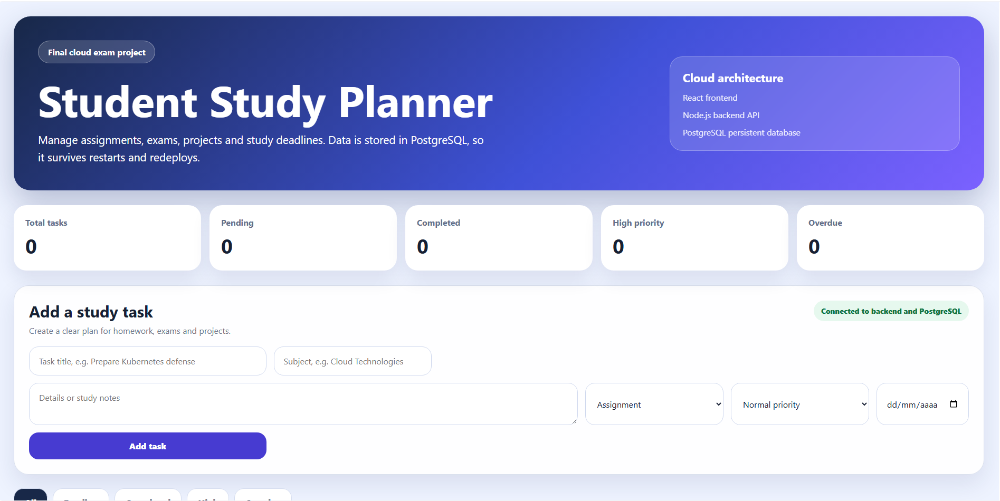
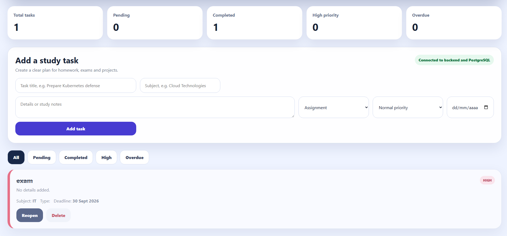
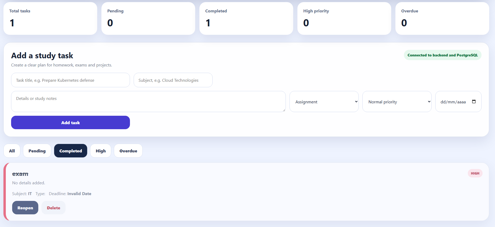

# 📚 Student Study Planner

[](https://github.com/ByCur/student-study-planner-sk1/actions/workflows/ci.yml)

A full-stack cloud application designed to help university students manage assignments, exams, projects and study deadlines.

Built with **React, Node.js, Express, PostgreSQL and Docker**, with automated integration testing and Continuous Integration using GitHub Actions.

## 🌐 Live Demo

👉 **[Open Student Study Planner](https://tasknotes-frontend.onrender.com))**

> The application is hosted on Render's free tier, so the first request may take a few seconds if the service has been inactive.

---

## 📸 Screenshots

### Dashboard



### Task Management



### Completed Tasks



---

## ✨ Features

- Create study tasks for assignments, exams, projects and other activities
- Add subject, description, task type, priority and deadline
- Track pending and completed tasks
- Mark tasks as completed and reopen them
- Delete tasks
- Filter tasks by status and priority
- Detect overdue tasks automatically
- Display real-time dashboard statistics
- Persistent PostgreSQL data storage
- REST API communication between frontend and backend
- Dockerized frontend, backend and database
- Automated backend integration tests
- Continuous Integration with GitHub Actions

---

## 🏗️ Architecture

```text
                    ┌─────────────────┐
                    │      User       │
                    └────────┬────────┘
                             │
                             ▼
                    ┌─────────────────┐
                    │ React Frontend  │
                    │      Vite       │
                    └────────┬────────┘
                             │
                          REST API
                             │
                             ▼
                    ┌─────────────────┐
                    │ Node.js/Express │
                    │     Backend     │
                    └────────┬────────┘
                             │
                             ▼
                    ┌─────────────────┐
                    │   PostgreSQL    │
                    │    Database     │
                    └─────────────────┘
```

The application is divided into three main services:

- **Frontend:** React application built with Vite
- **Backend:** Node.js and Express REST API
- **Database:** PostgreSQL persistent storage

Docker Compose is used to run the complete application stack locally.

---

## 🛠️ Tech Stack

### Frontend

- React
- JavaScript
- Vite
- HTML
- CSS

### Backend

- Node.js
- Express
- REST API
- CORS
- Morgan

### Database

- PostgreSQL
- SQL

### Testing

- Jest
- Supertest
- PostgreSQL integration testing

### DevOps & Cloud

- Docker
- Docker Compose
- GitHub Actions
- Render
- Git
- GitHub

---

## 🧪 Testing

The backend includes automated integration tests that run against a real PostgreSQL test database.

The current test suite covers:

- Health check endpoint
- Task creation
- Input validation
- Task retrieval
- Completing and reopening tasks
- Task deletion
- Unknown routes
- Updating non-existent tasks
- Deleting non-existent tasks

Current test results:

```text
Test Suites: 1 passed
Tests:       9 passed

Statements: 80%
Branches:   76.47%
Functions:  100%
Lines:      80%
```

Coverage thresholds are enforced automatically by the CI pipeline.

---

## ⚙️ Continuous Integration

Every push and pull request to the `main` branch automatically triggers a GitHub Actions workflow.

The CI pipeline performs the following steps:

```text
Push / Pull Request
        │
        ▼
Create PostgreSQL test database
        │
        ▼
Install backend dependencies
        │
        ▼
Check backend syntax
        │
        ▼
Run integration tests
        │
        ▼
Generate test coverage
        │
        ▼
Install frontend dependencies
        │
        ▼
Build React frontend
        │
        ▼
Validate Docker Compose
        │
        ▼
       ✅ CI
```

This helps ensure that changes do not break the backend, frontend or container configuration.

---

## 🐳 Running Locally

### Requirements

To run the complete application locally you need:

- Docker
- Docker Compose

Clone the repository:

```bash
git clone https://github.com/ByCur/student-study-planner-sk1.git
cd student-study-planner-sk1
```

Build and start the application:

```bash
docker compose up --build
```

Then open:

```text
Frontend:
http://localhost:8080

Backend:
http://localhost:10000

Backend health check:
http://localhost:10000/health
```

To stop the application:

```bash
docker compose down
```

PostgreSQL data is stored in a Docker volume so it can persist between container restarts.

---

## 📁 Project Structure

```text
student-study-planner-sk1/
│
├── .github/
│   └── workflows/
│       └── ci.yml
│
├── backend/
│   ├── src/
│   │   ├── app.js
│   │   └── server.js
│   │
│   ├── tests/
│   │   └── tasks.test.js
│   │
│   ├── Dockerfile
│   ├── package.json
│   └── package-lock.json
│
├── frontend/
│   ├── src/
│   ├── Dockerfile
│   ├── nginx.conf
│   └── package.json
│
├── docs/
│   └── screenshots/
│
├── scripts/
├── docker-compose.yml
├── render.yaml
└── README.md
```

---

## 📖 What I Learned

This project gave me practical experience with:

- Designing and developing a full-stack web application
- Building REST APIs with Node.js and Express
- Working with PostgreSQL and relational databases
- Connecting frontend, backend and database services
- Managing application state with React
- Containerizing applications with Docker
- Using Docker Compose for multi-container applications
- Managing environment variables
- Deploying a full-stack application to the cloud
- Debugging cloud deployment and database connectivity issues
- Writing integration tests using Jest and Supertest
- Testing against a real PostgreSQL database
- Measuring code coverage
- Building a Continuous Integration pipeline with GitHub Actions
- Working with Git and GitHub

---

## 🔮 Future Improvements

Possible future improvements include:

- User authentication
- Multiple user accounts
- Improved form validation and error handling
- Automated frontend testing
- AI-assisted study planning
- Personalized study recommendations
- Calendar integration
- Notifications and reminders

---

## 👨‍💻 Author

**Pablo Pérez Arcas**

Computer Engineering student at the **University of Málaga (UMA)**  
Specialization in **Computing**  
Expected graduation: **June 2027**

Interested in:

- Software Engineering
- Artificial Intelligence
- Cloud Engineering
- Blockchain

🌍 Erasmus academic experience at the **Technical University of Košice (TUKE), Slovakia**  
🇬🇧 Cambridge English **B2**

---

## 📌 Project Status

Originally developed as an academic cloud computing project and later improved as part of my software engineering portfolio with:

**Docker · Cloud Deployment · Integration Testing · Code Coverage · Continuous Integration**
